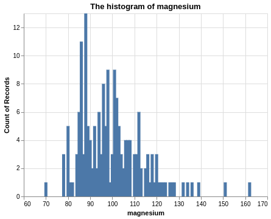

## `nursepy` test


[](https://codecov.io/gh/UBC-MDS/nursepy)


[](https://nursepy.readthedocs.io/en/latest/?badge=latest)

A python package for streamlining the front end of the machine learning
workflow.

### Summary

-----

Common to the front end of most machine learning pipelines is an
exploratory data analysis (EDA) and feature preprocessing. EDA’s
facilitate a better understanding of the data being analyzed and allows
for a targeted and more robust model development while feature
imputation and preprocessing is a requirement for many machine learning
alogirthms. `nursepy` aims to streamline the front end of the machine
learning pipeline by generating descriptive summary tables and figures,
automating feature imputation, and automating preprocessing. Automated
feature imputations and preprocessing detection has been implemented to
minimize time and optimize the processing methods used. The functions in
`nursepy` were developed to provide useful and informative metrics that
are applicable to a wide array of datasets.

*`nursepy` was developed as part of DSCI 524 of the MDS program at
    UBC.*

### Installation:

    pip install --index-url https://test.pypi.org/simple/ --extra-index-url https://pypi.org/simple nursepy

### Features

-----

The package includes the following three
functions:

| Function  | Input                 | Output                                           | Description                                                                                           |
| --------- | --------------------- | ------------------------------------------------ | ----------------------------------------------------------------------------------------------------- |
| `eda`     | \- a pandas dataframe | \- a python dictionary                           | \- Dictionary that contains histogram and summary statistics for each column                          |
| `impute`  | \- a pandas dataframe | \- a pandas dataframe with imputed values        | \- Functionality for automatic imputation detection and user defined imputation method selection      |
| `preproc` | \- a pandas dataframe | \- a pandas dataframe with preprocessed features | \- Functionality for automatic feature preprocessing detection and user defined feature preprocessing |

### Python Ecosystem

-----

`nursepy` was developed to closely align with:

  - [scikit-learn](https://scikit-learn.org/stable/install.html)
  - [pandas](https://pandas.pydata.org/)
  - [numpy](https://numpy.org/)

However, the functions herein streamline and automate the front-end
machine learning pipeline for use with any machine learning package.

### Dependencies

-----

  - numpy==1.18.1
  - pandas==0.25.3
  - sklearn==0.0
  - altair==3.2.0
  - pytest==5.3.2

### Usage

#### `eda()`

The `eda()` function helps to easily explore the data by both giving
visual insights and summary statistics for a chosen column.

*Note:*

*- Function should be run in Jupyter Lab (or other IDE) to view output.
If Jupyter Notebook is used, run
`altair.renderers.enable('notebook')`*  
*- Depending on the data set, `alt.data_transformers.disable_max_rows()`
may be required before running `eda`*

These are required imports:

``` python
from sklearn.datasets import load_wine
import pandas as pd
from nursepy.eda import eda
```

To see how this function works, we will load `wine` dataset from
sklearn.

``` python
wine = load_wine()
data = pd.DataFrame(wine.data)
data.columns = wine.feature_names
```

After calling the `eda()` function, we will get the following outputs:

``` python
eda_results = eda(data)
eda_results['stats']['magnesium']
```

    ##         magnesium
    ## count  178.000000
    ## mean    99.741573
    ## std     14.282484
    ## min     70.000000
    ## 25%     88.000000
    ## 50%     98.000000
    ## 75%    107.000000
    ## max    162.000000

``` python
eda_results['histograms']['magnesium']
```



-----

### `impute`

The purpose of `impute` is to automatically impute missing data by
comparing test results of multiple models using different imputation
methods (currently this function only works on numeric data). An
`sklearn` `RandomForestClassifier` or `RandomForestRegressor` is used to
compute scores for each imputed data set.

Required imports:

``` python
from nursepy.impute import impute
import numpy as np
import pandas as pd
```

To use `impute`, we need a dataset with missing data. Also, this data
needs to be split into training and test sets. Let’s create our data:

``` python
Xt = {'one': np.random.randn(10), 'two': np.random.randn(10),
     'three': np.random.randn(10), 'four': np.random.randn(10)}

yt_c = pd.DataFrame({'target': [1, 0, 1, 1, 0, 0, 0, 1, 0, 1]})

Xt['two'][3:5] = None
Xt['three'][7] = None
Xt['four'][1] = None
Xt['four'][3] = None
Xt = pd.DataFrame(Xt)

Xv = {'one': np.random.randn(10), 'two': np.random.randn(10),
      'three': np.random.randn(10), 'four': np.random.randn(10)}

yv_c = pd.DataFrame({'target': [1, 0, 0, 0, 1, 1, 1, 0, 0, 1]})

Xv['one'][2:4] = None
Xv['two'][2] = None
Xv['four'][1] = None
Xv['four'][4] = None
Xv = pd.DataFrame(Xv)
```

</br>

Now that that’s over with, let’s call `impute`\!

``` python
summary = impute(Xt, yt_c, Xv, yv_c, model_type='classification')
```

</br>

A call to `impute` returns a dictionary with the following keys-values:

  - “imputation\_scores\_”: a dictionary of the 6 imputation methods and
    their associated `RandomForest` scores
      - remove\_na  
      - forward\_fill  
      - backward\_fill  
      - feature\_mean  
      - feature\_median  
      - feature\_interpolate  
  - “missing\_value\_counts\_”: a dictionary with feature’s as keys and
    number of missing values as associated values  
  - “missing\_indeces\_”: a dictionary with the indeces of rows that
    contain missing data for the train and test sets  
  - “best\_imputed\_data\_”: a dataframe with the imputed data of the
    imputation method with the best score

</br>

We can access the return objects from `impute` by indexing their keys.
Let’s take a look at the `RandomForestClassifer` scores for each of the
imputation methods:

``` python
pd.DataFrame({'Method': list(summary['imputation_scores_'].keys()),
              'Score': list(summary['imputation_scores_'].values())})
```

    ##                 Method     Score
    ## 0            remove_na  0.333333
    ## 1         forward_fill  0.400000
    ## 2        backward_fill  0.300000
    ## 3         feature_mean  0.300000
    ## 4       feature_median  0.300000
    ## 5  feature_interpolate  0.200000

</br>

The number of missing values in each column can be extracted the same
way:

``` python
pd.DataFrame({'Feature': list(summary['missing_value_counts_'].keys()),
              'Count': list(summary['missing_value_counts_'].values())})
```

    ##   Feature  Count
    ## 0     one      0
    ## 1     two      2
    ## 2   three      1
    ## 3    four      2

</br>

And finally, let’s extract the training data *(index 0 for training and
1 for validation)* with the best imputed score:

``` python
summary['best_imputed_data_'][0]
```

    ##         one       two     three      four
    ## 0 -1.047538  0.042689 -0.247081 -0.363426
    ## 1 -0.304713  0.800541 -2.626776 -0.363426
    ## 2  0.327052 -0.755122 -0.505563  0.915825
    ## 3  0.679104 -0.755122  1.582215  0.915825
    ## 4 -0.179888 -0.755122  0.857867  1.016828
    ## 5 -0.085712 -0.774920  0.107280  1.354976
    ## 6  0.860473  0.029632 -0.979732  1.270861
    ## 7  0.217099  0.384991 -0.979732 -0.425301
    ## 8  0.191896 -1.207064  0.105697  0.742878
    ## 9  0.207372 -0.607005  1.752648 -0.216495

-----

### `preproc`

`preproc` preprocesses data frames, including onehot encoding, scaling,
and imputation, and label encoding.

Required imports:

``` python
from nursepy.preproc import preproc
import pandas as pd
from sklearn.datasets import load_wine
```

</br>

Let’s load some data from sklearn:

``` python
wine = load_wine()
data = pd.DataFrame(wine.data)
data.columns = wine.feature_names
```

</br>

The output of `preproc` is a tuple with the processed training and test
sets. Let’s visualize the preprocessed train set:

``` python
X_train_processed, X_test_processed = preproc(data)
X_train_processed
```

    ##      alcohol  malic_acid   ash  ...   hue  od280/od315_of_diluted_wines  proline
    ## 0      14.23        1.71  2.43  ...  1.04                          3.92   1065.0
    ## 1      13.20        1.78  2.14  ...  1.05                          3.40   1050.0
    ## 2      13.16        2.36  2.67  ...  1.03                          3.17   1185.0
    ## 3      14.37        1.95  2.50  ...  0.86                          3.45   1480.0
    ## 4      13.24        2.59  2.87  ...  1.04                          2.93    735.0
    ## ..       ...         ...   ...  ...   ...                           ...      ...
    ## 173    13.71        5.65  2.45  ...  0.64                          1.74    740.0
    ## 174    13.40        3.91  2.48  ...  0.70                          1.56    750.0
    ## 175    13.27        4.28  2.26  ...  0.59                          1.56    835.0
    ## 176    13.17        2.59  2.37  ...  0.60                          1.62    840.0
    ## 177    14.13        4.10  2.74  ...  0.61                          1.60    560.0
    ## 
    ## [178 rows x 13 columns]

-----

### Documentation

The official documentation is hosted on Read the Docs:
<https://nursepy.readthedocs.io/en/latest/>

### Credits

This package was created with Cookiecutter and the
UBC-MDS/cookiecutter-ubc-mds project template, modified from the
[pyOpenSci/cookiecutter-pyopensci](https://github.com/pyOpenSci/cookiecutter-pyopensci)
project template and the
[audreyr/cookiecutter-pypackage](https://github.com/audreyr/cookiecutter-pypackage).
